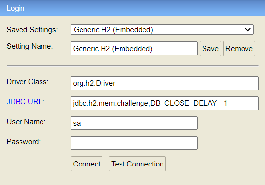

# Java Backend Challenge

To run the app execute the following command:

```bash
> ./gradlew run
```

To run the tests execute:

```bash
> ./gradlew test
```


### 1. Introduction. 
The project consists of a prototype bases in a single file with some business logic and entities added.
Without any kind of persistence layer implemented and with the requirement of improving the scalability and fragility owned.

#### Modifications at the beginning
The content of the single file of the initial project has been divided into several parts. On the one hand the model, which includes all the entities already existing at the beginning plus the new ones
that have been created. On the other hand, the services and repositories, where the business logic and logic for access to the database have been included.

The test file included has been removed, adding during the process the rest of independent test files.
The way of working on this project has been developing with TDD methodology, through unitary tests.

Moreover it has been added a relational SQL database for the data persistency. Especifically, it consists on an embedded H2 database with JPA and Hibernate support to generate automatically the database model from code annotations.

### 2. Programming language and environment
With regard to the language used, the project has been developed with Java 8 and the Spring Boot 2 framework.
As a developer IDE it has been used IntelliJ with the Git Flow plugin to support git actions.

### 3. Third party libraries
As support it has been used Lombok to generate entity getters, setters, non parameters constructors and so on.
As it has been said before, the embedded H2 database has been added to the project as dependency in the Gradle file. For testing purposes, it has been opted for an embedded database, because of its simplicity and easy to config with the application.properties file attached in the project. 
In addition, a SQL initial script is attached too. When the project is launched, the data.sql file is also executed.
Localhost URL for accessing the Database (See image below):
```
http://localhost:8080/h2
``` 

 


### 4. Refactor reasoning
In order to achieve better scalability in this project it has been opted for splitting the model in entity clases, as usual. With a typical project structure in several layers:
- Services
- Entities
- Repositories

Moreover it has been fixed some bugs included in the original code, aparently on purpose,  in order to achieve correct results.
With the regard of improve the original fragility of the code it has been added several test clases, some Exception treatment and overall, developing with CLEAN CODE statements in mind:
- Attributes, class and methods written with meaningful names.
    - Classes with nouns and methods with verbs.
- Although is a prototype, some error handling has been added.
- Use of interfaces to achieve multiple inheritance in some repositories or achieve abstraction.
- Small methods and classes.
- Use of Java 8 advantages:
    - To manage, filter and collect collections. 
    - Class Optional to manage potential null pointer objects returned from database.
- Logging library (slf4) for testing purposes.
- TDD methodology with unitary tests.

### 5. Acknoledgements
I hope the written code, structure and technology used are of your liking.
I will apreciatte any kind of improvement proposals and technical corrections.

